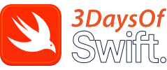

 
© 2026 [3DaysOfSwift.com](https://www.3DaysOfSwift.com). All rights reserved.

## This Repository

This repository contains two SwiftUI Xcode projects alongside two supporting Xcode playgrounds designed to help developers understand the architectural patterns commonly discussed in iOS interviews — MV and MVVM. MVC can be found in another UIKit-based repo. 

These projects and playgrounds focus on separating application logic from the user interface, helping developers better understand how Swift applications can be structured for clarity and maintainability.

## 2x SwiftUI Xcode Projects (MV & MVVM)

Included within this repository are two SwiftUI Xcode projects demonstrating both MV and MVVM architecture patterns.

The MV project demonstrates a lightweight architecture suitable for smaller applications and simple prototypes, while the MVVM project introduces a more scalable structure commonly used in larger commercial applications.

Explore both projects to compare how models, business logic, and views can be organised to improve readability, stability, and long-term maintainability.

## The Model Playground

The shared application model used throughout both Xcode projects has been isolated into this dedicated Xcode playground.

This playground focuses entirely on the model, making it easier to understand how application data and business logic can exist independently from the user interface.

## The View Playground

The View is the presentation layer of the application and this playground demonstrates how views can be separated from the underlying model logic.

A shared Model.swift file stored within the Sources folder is used to separate the model implementation from the playground presentation code, helping demonstrate how SwiftUI views can interact with underlying program it represents.

------------------------

Download this Xcode playground at [3DaysOfSwift.com](https://www.3DaysOfSwift.com).

------------------------

## Official Swift Documentation
Apple created [The Swift Programming Language (TSPL)](https://docs.swift.org/swift-book/documentation/the-swift-programming-language/thebasics) book to discuss and describe the following language features.

1. [The Basics](https://docs.swift.org/swift-book/documentation/the-swift-programming-language/thebasics)
2. [Basic Operators](https://docs.swift.org/swift-book/documentation/the-swift-programming-language/basicoperators)
3. [Strings and Characters](https://docs.swift.org/swift-book/documentation/the-swift-programming-language/stringsandcharacters)
4. [Collection Types](https://docs.swift.org/swift-book/documentation/the-swift-programming-language/collectiontypes)
5. [Control Flow](https://docs.swift.org/swift-book/documentation/the-swift-programming-language/controlflow)
6. [Functions](https://docs.swift.org/swift-book/documentation/the-swift-programming-language/functions)
7. [Closures](https://docs.swift.org/swift-book/documentation/the-swift-programming-language/closures)
8. [Enumerations](https://docs.swift.org/swift-book/documentation/the-swift-programming-language/enumerations)
9. [Structures and Classes](https://docs.swift.org/swift-book/documentation/the-swift-programming-language/classesandstructures)
10. [Properties](https://docs.swift.org/swift-book/documentation/the-swift-programming-language/properties)
11. [Methods](https://docs.swift.org/swift-book/documentation/the-swift-programming-language/methods)
12. [Subscripts](https://docs.swift.org/swift-book/documentation/the-swift-programming-language/subscripts)
13. [Inheritance](https://docs.swift.org/swift-book/documentation/the-swift-programming-language/inheritance)
14. [Initialization](https://docs.swift.org/swift-book/documentation/the-swift-programming-language/initialization)
15. [Deinitialization](https://docs.swift.org/swift-book/documentation/the-swift-programming-language/deinitialization)
16. [Optional Chaining](https://docs.swift.org/swift-book/documentation/the-swift-programming-language/optionalchaining)
17. [Error Handling](https://docs.swift.org/swift-book/documentation/the-swift-programming-language/errorhandling)
18. [Concurrency](https://docs.swift.org/swift-book/documentation/the-swift-programming-language/concurrency)
19. [Macros](https://docs.swift.org/swift-book/documentation/the-swift-programming-language/macros)
20. [Type Casting](https://docs.swift.org/swift-book/documentation/the-swift-programming-language/typecasting)
21. [Nested Types](https://docs.swift.org/swift-book/documentation/the-swift-programming-language/nestedtypes)
22. [Extensions](https://docs.swift.org/swift-book/documentation/the-swift-programming-language/extensions)
23. [Protocols](https://docs.swift.org/swift-book/documentation/the-swift-programming-language/protocols)
24. [Generics](https://docs.swift.org/swift-book/documentation/the-swift-programming-language/generics)
25. [Opaque Types](https://docs.swift.org/swift-book/documentation/the-swift-programming-language/opaquetypes)
26. [Automatic Reference Counting](https://docs.swift.org/swift-book/documentation/the-swift-programming-language/automaticreferencecounting)
27. [Memory Safety](https://docs.swift.org/swift-book/documentation/the-swift-programming-language/memorysafety)
28. [Access Control](https://docs.swift.org/swift-book/documentation/the-swift-programming-language/accesscontrol)
29. [Advanced Operators](https://docs.swift.org/swift-book/documentation/the-swift-programming-language/advancedoperators)

Read our Xcode playground conversion only at [3DaysOfSwift.com](https://www.3DaysOfSwift.com)

--------------------------

[Website](https://www.3DaysOfSwift.com) | [Subreddit Community](https://www.reddit.com/r/3DaysOfSwift)

© 2026 [3DaysOfSwift.com](https://www.3DaysOfSwift.com). All rights reserved.

Built for professional iOS developers.

👩🏿‍💻🧑🏻‍💻🙋🏿‍♀️🧑🏼‍💻👩🏼‍💼👩🏽‍💻🧑🏿‍💻💁🏼‍♀️👩🏼‍💻👨🏼‍💻👨🏽‍💻🙋🏽‍♂️👩🏻‍💻🧑🏾‍💻👩🏻‍💻👩🏾‍💻👨🏼‍💻🙋🏻‍♂️👨🏿‍💻🙋🏼‍♂️