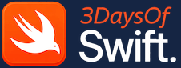
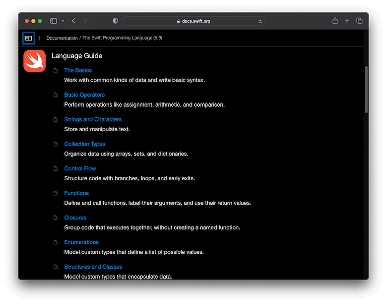

 ©️ 2026

Copyright 2026 [3DaysOfSwift.com](https://www.3DaysOfSwift.com)

## This Repo
This repository is one of the many online repos we have containing educational content to teach & learn Swift. Enjoy!

## Official Swift Book - The Swift Programming Language  (TSPL)
[Swift 5.7 iBooks ePub](https://books.apple.com/book-series/swift-programming-series/id888896989) - No longer supported - AppleBooks version

[Swift.org HTML version](https://docs.swift.org/swift-book/documentation/the-swift-programming-language/) - Supported HTML version

[Our Xcode Playground Conversion](https://www.3daysofswift.com/book) - Downloadable v5.7 as Xcode playgrounds

## Official Book Contents
Apple created [TSPL](https://docs.swift.org/swift-book/documentation/the-swift-programming-language/thebasics) to teach the following language features.

1. [The Basics](https://docs.swift.org/swift-book/documentation/the-swift-programming-language/thebasics)
2. [Basic Operators](https://docs.swift.org/swift-book/documentation/the-swift-programming-language/basicoperators)
3. [Strings and Characters](https://docs.swift.org/swift-book/documentation/the-swift-programming-language/stringsandcharacters)
4. [Collection Types](https://docs.swift.org/swift-book/documentation/the-swift-programming-language/collectiontypes)
5. [Control Flow](https://docs.swift.org/swift-book/documentation/the-swift-programming-language/controlflow)
6. [Functions](https://docs.swift.org/swift-book/documentation/the-swift-programming-language/functions)
7. [Closures](https://docs.swift.org/swift-book/documentation/the-swift-programming-language/closures)
8. [Enumerations](https://docs.swift.org/swift-book/documentation/the-swift-programming-language/enumerations)
9. [Structures and Classes](https://docs.swift.org/swift-book/documentation/the-swift-programming-language/classesandstructures)
10. [Properties](https://docs.swift.org/swift-book/documentation/the-swift-programming-language/properties)
11. [Methods](https://docs.swift.org/swift-book/documentation/the-swift-programming-language/methods)
12. [Subscripts](https://docs.swift.org/swift-book/documentation/the-swift-programming-language/subscripts)
13. [Inheritance](https://docs.swift.org/swift-book/documentation/the-swift-programming-language/inheritance)
14. [Initialization](https://docs.swift.org/swift-book/documentation/the-swift-programming-language/initialization)
15. [Deinitialization](https://docs.swift.org/swift-book/documentation/the-swift-programming-language/deinitialization)
16. [Optional Chaining](https://docs.swift.org/swift-book/documentation/the-swift-programming-language/optionalchaining)
17. [Error Handling](https://docs.swift.org/swift-book/documentation/the-swift-programming-language/errorhandling)
18. [Concurrency](https://docs.swift.org/swift-book/documentation/the-swift-programming-language/concurrency)
19. [Macros](https://docs.swift.org/swift-book/documentation/the-swift-programming-language/macros)
20. [Type Casting](https://docs.swift.org/swift-book/documentation/the-swift-programming-language/typecasting)
21. [Nested Types](https://docs.swift.org/swift-book/documentation/the-swift-programming-language/nestedtypes)
22. [Extensions](https://docs.swift.org/swift-book/documentation/the-swift-programming-language/extensions)
23. [Protocols](https://docs.swift.org/swift-book/documentation/the-swift-programming-language/protocols)
24. [Generics](https://docs.swift.org/swift-book/documentation/the-swift-programming-language/generics)
25. [Opaque Types](https://docs.swift.org/swift-book/documentation/the-swift-programming-language/opaquetypes)
26. [Automatic Reference Counting](https://docs.swift.org/swift-book/documentation/the-swift-programming-language/automaticreferencecounting)
27. [Memory Safety](https://docs.swift.org/swift-book/documentation/the-swift-programming-language/memorysafety)
28. [Access Control](https://docs.swift.org/swift-book/documentation/the-swift-programming-language/accesscontrol)
29. [Advanced Operators](https://docs.swift.org/swift-book/documentation/the-swift-programming-language/advancedoperators)

## Swift.org Online Version of TSPL
Swift.org uses the contents of the book as a Language Guide to document each main language feature.

[Officially supported HTML version](https://docs.swift.org/swift-book/documentation/the-swift-programming-language/thebasics)

The official html version of the Swift Language Guide can be found [here](https://docs.swift.org/swift-book/documentation/the-swift-programming-language/thebasics) and contains quite a huge amount of text. This playground of common Swift language features is small, light and focusses on executable code examples.

Simple & easy! But also, not the complete picture. [Learn more features](https://www.3daysofswift.com).

## What Is It?
An Xcode playground of executable code examples for all main Swift language features. Each playground page is organised by language feature. Developers should be able to quickly find the feature and execute the given example to refresh their knowledge of Swift syntax and how the code needs to be written to function.

## How To Become A Swift Engineer
Most companies who offer iOS developer jobs require maintenance for existing products (apps written in Swift). 

Today, a fast strategy to gain a job as a Junior iOS Developer may be to first learn the programming language (in order to pass an interview) and then learn UI and apps while employed and working on an existing product.

1. Learn Swift
2. Apply for jobs - fix bugs for existing products in Xcode
3. Learn about UI - maybe use A.I. to build UI
4. Learn about iOS apps 

## Why Learn Swift?
Wouldn't it make sense to build a career writing software for the worlds no.1 most profitable company? 

According to Fortune Global’s 500 list in 2020, Apple Inc was the global most profitable company reporting an annual profit of $57.41 billion US dollars. In a world with an ever increasing demand for smart devices iOS Developers will never be without work. 

In fact, those who study computer programming languages used by companies such as Apple, Microsoft, Google and Amazon will never be short of job offers and look forward to a very profitable and successful career.

[Swift](https://docs.swift.org) is the latest programming language chosen by Apple to write apps and  supporting frameworks for all iOS and macOS products. It was first released in June 2014 as a replacement for it's predecessor Objective-C. 

## Recommended Learning Path

**Step 1**: Learn the Swift programming language.

**Step 2**: Learn about code architecure and how to structure code.

**Step 3**: Learn about UI and iOS apps (while employed).

## Recommended Studying
We recommend studying the following Swift language features to apply for a job as a Junior iOS Developer.

1. [The Basics](https://docs.swift.org/swift-book/documentation/the-swift-programming-language/thebasics)
2. [Control Flow](https://docs.swift.org/swift-book/documentation/the-swift-programming-language/controlflow)
3. [Optionals](https://docs.swift.org/swift-book/documentation/the-swift-programming-language/optionalchaining)
4. [Functions](https://docs.swift.org/swift-book/documentation/the-swift-programming-language/functions) and [Closures](https://docs.swift.org/swift-book/documentation/the-swift-programming-language/closures)
5. [Classes](https://docs.swift.org/swift-book/documentation/the-swift-programming-language/classesandstructures)
6. [Structs](https://docs.swift.org/swift-book/documentation/the-swift-programming-language/classesandstructures)
7. [Enums](https://docs.swift.org/swift-book/documentation/the-swift-programming-language/enumerations)
8. [ARC](https://docs.swift.org/swift-book/documentation/the-swift-programming-language/automaticreferencecounting) (Automatic Reference Counting)
9. [Extensions](https://docs.swift.org/swift-book/documentation/the-swift-programming-language/extensions)
10. [Protocols](https://docs.swift.org/swift-book/documentation/the-swift-programming-language/protocols)
11. [Concurrency](https://docs.swift.org/swift-book/documentation/the-swift-programming-language/concurrency)
12. [Error Handling](https://docs.swift.org/swift-book/documentation/the-swift-programming-language/errorhandling)
13. [Generics](https://docs.swift.org/swift-book/documentation/the-swift-programming-language/generics)

--------------------------

 

[Website](https://www.3DaysOfSwift.com)

Copyright 2026 [3DaysOfSwift.com](https://www.3DaysOfSwift.com). All rights reserved. 

Welcome to our community of [3DaysOfSwift.com](https://www.3DaysOfSwift.com) developers!

🧕🏻👩🏿‍💻🙋🏽‍♂️👨🏿‍💼👩🏼‍💼👩🏻‍💻💁🏼‍♀️👨🏼‍💻👨🏼‍💼🙋🏻‍♂️🙋🏻‍♀️👩🏼‍💻🙋🏿💁🏽‍♂️🧑🏿‍💻🙋🏽‍♀️🙋🏿‍♀️🧕🏾🙋🏼‍♂️🧑🏿‍💻